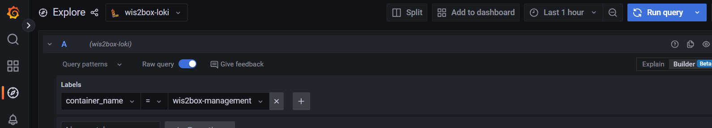
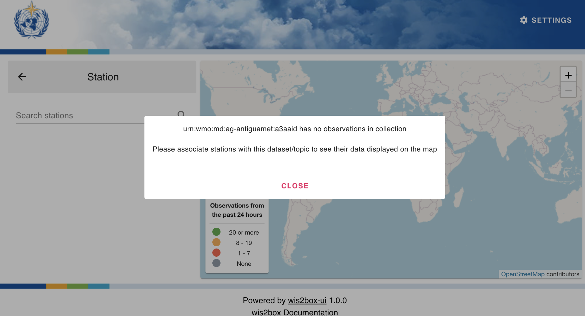
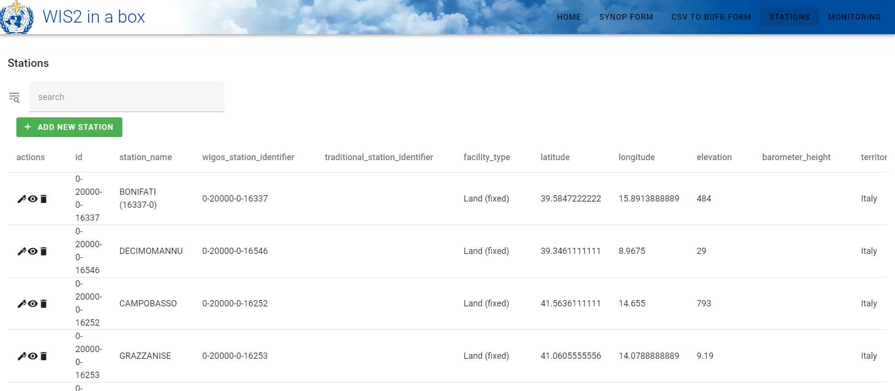
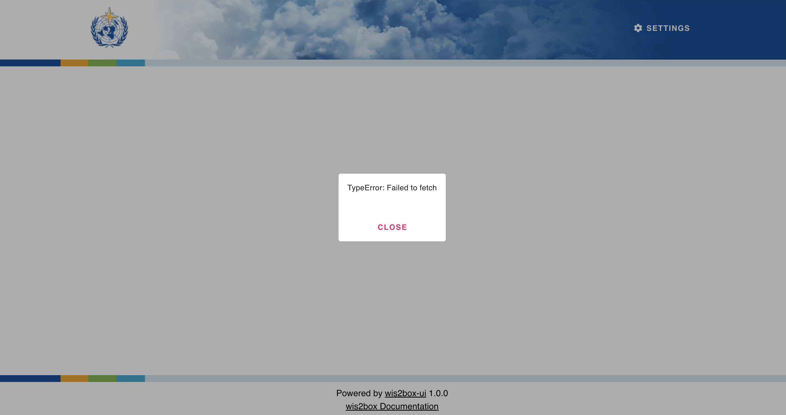
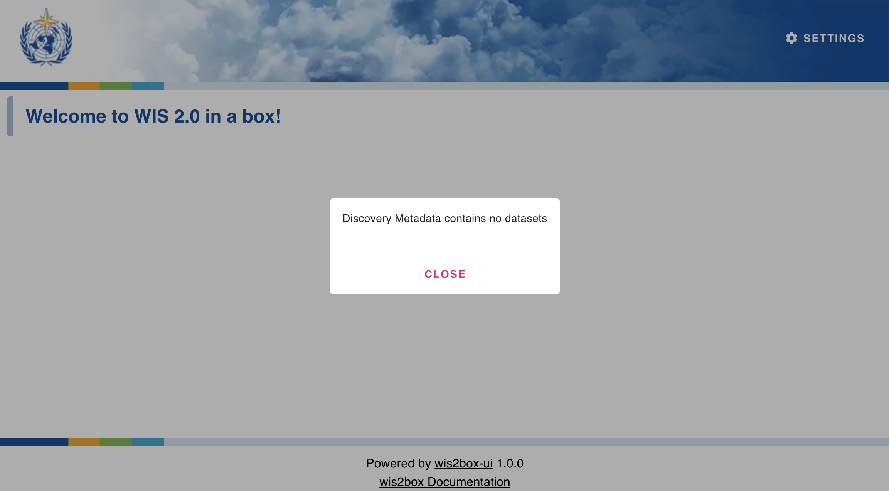

.. _troubleshooting:

Troubleshooting
===============

This page lists several commonly seen issues and how to address them.

permission denied after executing "python3 wis2box-ctl.py start"
----------------------------------------------------------------

This command `python3 wis2box-ctl.py start` is a python-wrapper using `docker compose`-commands, if you see a permission denied error, 
it is likely that the user running the command does not have the required permissions to run docker commands.

To fix this, make sure to add your user to the `docker` group:

.. code-block:: bash

    sudo usermod -aG docker $USER
    # Log out and back in for changes to take effect

Bind for 0.0.0.0:XX failed: port is already allocated
-----------------------------------------------------

The wis2box-stack includes a set of services that bind to specific ports on the host system.

Make sure that the ports required on the host are available see :ref:`getting-started` for the list of ports used by the wis2box-stack.

If you are unsure which process is using a specific port, you can try to check using one of the following commands:

.. code-block:: bash

    sudo lsof -i :80   # Find process using port 80
    sudo netstat -tuln # Alternative check

wis2box-ctl.py status: one or more containers are restarting
------------------------------------------------------------

If the command ``python3 wis2box-ctl.py status``, showing one or more services as restarting or unhealthy, 
they are likely failing to start due to an error in the configuration or insufficient resources resulting in the entrypoint script failing.

If services are not running at all (status shows exited or not running), start them: 

.. code-block:: bash

   python3 wis2box-ctl.py start

Please check for docker issues as described above during the startup process.

If services are restarting/unhealthy, check the logs to identify the cause.

If Grafana is running: 

You can use the 'Explore' option in Grafana running on port 3000 of your instance to view the logs of the wis2box services. Open a browser and navigate to ``http://<your-instance-ip>:3000``.  Select 'Explore' from the menu on the left,
then select 'wis2box-loki' as the datasource and use ``label=container_name`` as illustrated in the image below:

Select the ``container_name`` for the service you want to inspect, click on the 'Run query' button and scroll down to view the logs.

If Grafana is not accessible:

Check logs directly from the host:

.. code-block:: bash

   docker compose logs --tail=200 <container_name> 

Please check the logs for the following containers:

- `wis2box-management`
- `wis2box-minio`
- `wis2box-api`

Common causes: 

1. WIS2BOX_STORAGE_PASSWORD too short (MinIO fails to start, edit your `wis2box.env` file and set a longer password)  

2. WIS2BOX_BROKER_PASSWORD contains @ (broker authentication fails, edit your `wis2box.env` file and set a password without @)

3. Insufficient disk space (Use `df -h` to check disk space)

4. Docker volumes present from an older wis2box installation (use `docker volume ls` to list volumes and `docker volume rm <volume_name>` to remove them)

After fixing the issue, restart all services: 

.. code-block:: bash

   python3 wis2box-ctl.py stop
   python3 wis2box-ctl.py start

No station on map in wis2box-ui
-------------------------------

The stations displayed in the wis2box-ui per dataset are defined by the topic associated with the station. If the topic for this dataset has no stations associated to it, you will get this pop-up:

   
Consult the user-guide for instructions on how to manage the stations in the wis2box-webapp.

The Access Key Id you provided does not exist in our records
------------------------------------------------------------

If you see this error when uploading data to the wis2box-incoming storage, you have provided the wrong username and/or password to access MinIO.
Check the values for ``WIS2BOX_STORAGE_USERNAME`` and ``WIS2BOX_STORAGE_PASSWORD`` set in the ``wis2box.env`` file.

ERROR - Failed to publish, wsi: ..., tsi: XXXXX
-----------------------------------------------

Data arrived for a station that is not present in the station metadata cache. 

Use the ``station editor`` in ``wis2box-webapp`` to add the missing station and associate it with the correct topic hierarchy.

After saving, the cache is refreshed and the station becomes available to pipelines.

wis2box UI connection error
---------------------------

If when you access the wis2box UI you see the interface but no datasets are visible; check the ``WIS2BOX_URL`` and ``WIS2BOX_API_URL`` are set correctly.

If when you access the wis2box UI you see a TypeError: Failed to fetch error
This indicates that the UI could not connect to the wis2box API：

Check that:

1. WIS2BOX_API_URL in your configuration points to the correct API endpoint (including protocol, host, and port).

2. The wis2box API service is running and accessible from your browser.

3. Any reverse proxy or firewall is correctly forwarding requests to the API.

4. After correcting the configuration, restart wis2box for the changes to take effect.

wis2box UI is empty
-------------------
If when you access the wis2box UI you see the interface but no datasets are visible, and a message appears saying ``Discovery Metadata contains no datasets``

This means the collection `discovery-metadata` in the API-backend is empty, either because no datasets have been created yet or the docker volume `wis2box_project_es-data` was removed.

Consult the user-guide for instructions on how to create datasets.