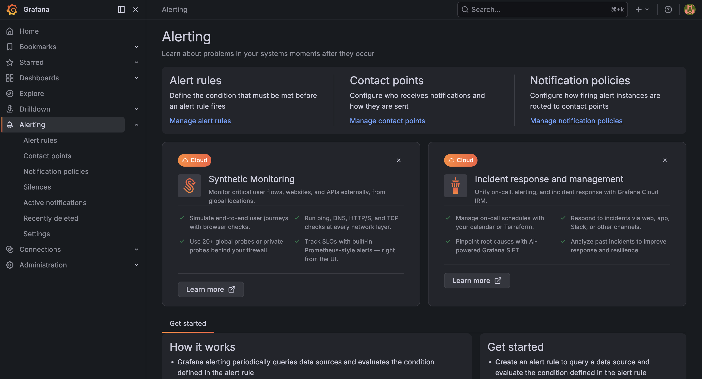
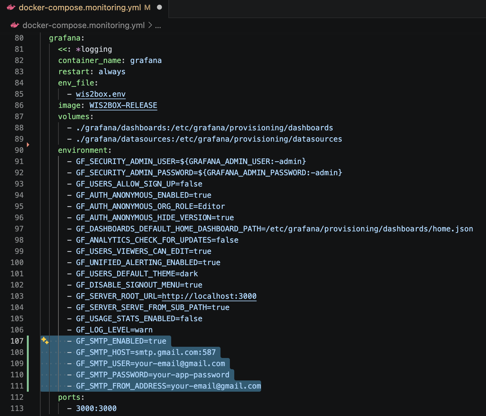
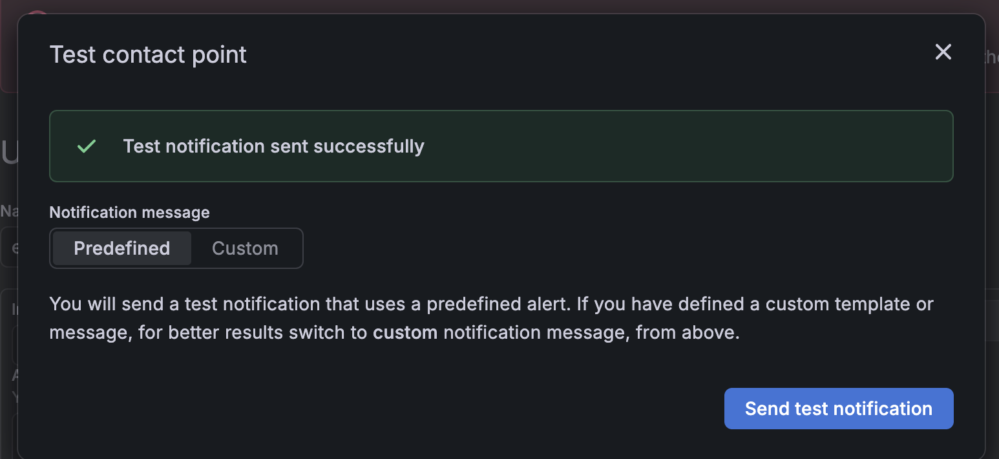
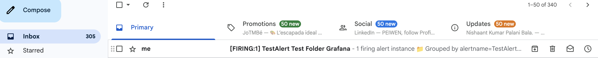
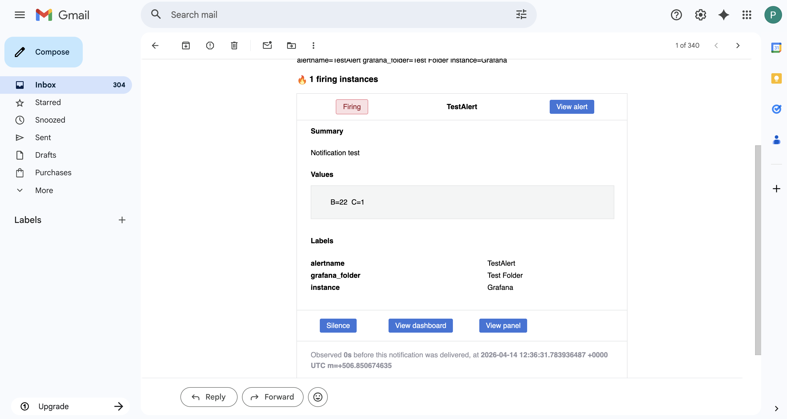

.. _alerts:

Alerts
======

Grafana Alerting Configuration
^^^^^^^^^^^^^^^^^^^^^^^^^^^^^^^^^
Grafana provides a built-in alerting system that allows users to monitor data and receive notifications when defined conditions are met.

In wis2box, alerting is configured using Grafana’s alerting interface. Alerts are defined as alert rules, and notifications are delivered via contact points such as email.

This guide explains how to configure email notifications and create alert rules in Grafana.

Configure SMTP for email notifications
--------------------------------------

To enable email notifications, Grafana must be configured with an SMTP server.

In wis2box deployments, SMTP settings are defined using environment variables
in the Docker Compose configuration.

docker-compose.monitoring.yml:

After updating the configuration, restart wis2box:

.. code-block:: bash

   python3 wis2box-ctl.py restart

Create a contact point
----------------------

Contact points define how alert notifications are delivered.

1. Open Grafana in your browser
2. Navigate to :guilabel:`Alerting --> Contact points`
3. Click :guilabel:`New contact point`
4. Select :guilabel:`Email`
5. Enter the recipient email address
6. Click :guilabel:`Save contact point`

Configure notification policies
-------------------------------

Notification policies define how alerts are routed to contact points.

1. Navigate to :guilabel:`Alerting --> Notification policies`
2. Edit the default policy
3. Under :guilabel:`Contact point`, select the email contact point created earlier
4. Save changes

.. note::

   If no notification policy is configured, alerts will not be delivered.

Create an alert rule
--------------------

Alerts are defined as alert rules.

1. Navigate to :guilabel:`Alerting --> Alert rules`
2. Click :guilabel:`New alert rule`
3. Configure:

   - Data source (for example, Prometheus)
   - Query
   - Condition (threshold or expression)
   - Evaluation interval

4. Click :guilabel:`Save rule`

Test the alert configuration
----------------------------

Trigger the alert rule by adjusting the condition or using test data.

After configuring the contact point and alert rule, Grafana will send an email notification when the alert is triggered.

The email includes details such as the alert name, state (e.g. *Firing*), summary, and associated labels. It also provides quick links to view the alert, dashboard, or panel in Grafana.

An example of a received email notification is shown below:

.. note::

   For Gmail:

      - If 2FA is enabled, generate an App Password and use it as the SMTP password
      - If 2FA is not enabled, ensure SMTP access is allowed

   For corporate email systems:

      - Contact your IT department for SMTP server settings and authentication details