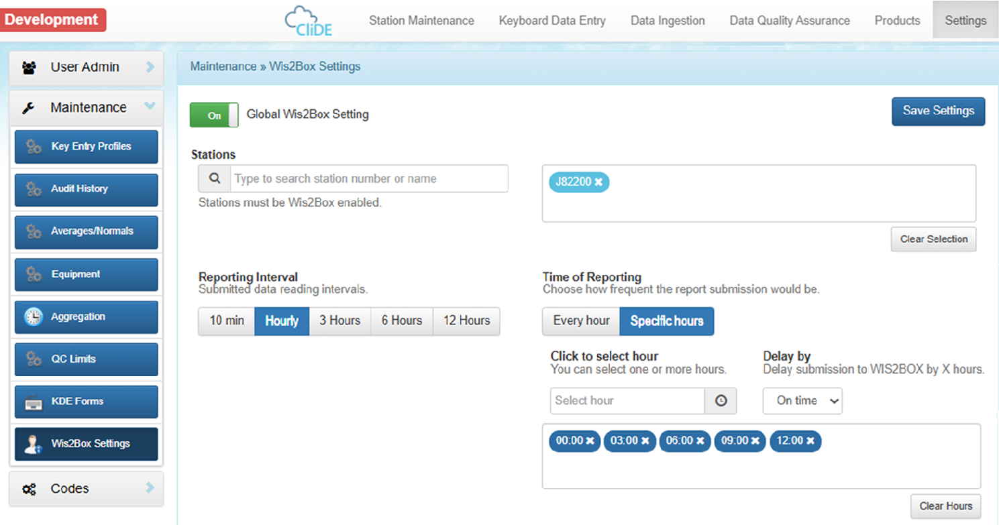

.. _CDMS-CLIDE:

Using CLiDE
===========

`CLiDE <https://www.bom.gov.au/government-and-industry/government-sectors/indo-pacific-development/climate-and-oceans-support-program-in-the-pacific/climate-data-for-the-environment>`_ 
is a climate data management system developed by the Australian Bureau of Meteorology to support developing countries, particularly in the Pacific region. 

CliDE services can be delivered via an in-house server or cloud computing services.
It archives both near-real-time and historical data for manual and automated surface, upper-air, and fixed marine (tide gauge) stations across the Pacific. 
CliDE also provides near-real-time and delayed semi-automated quality control, making it an effective data ingestion provider for submitting hourly data and DAYCLI to wis2box.

