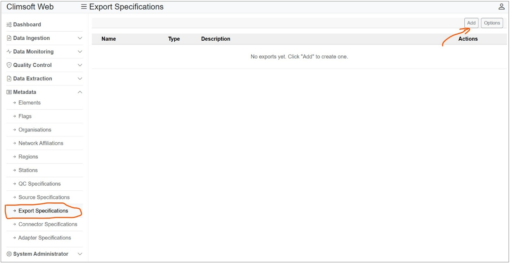
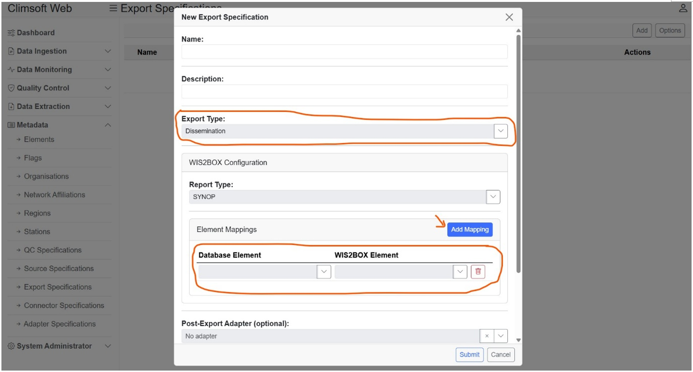
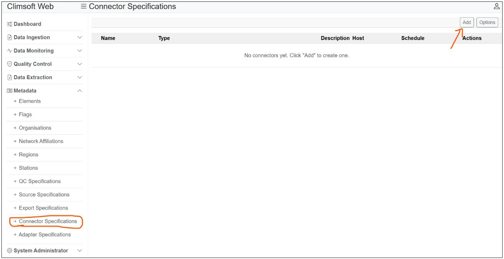
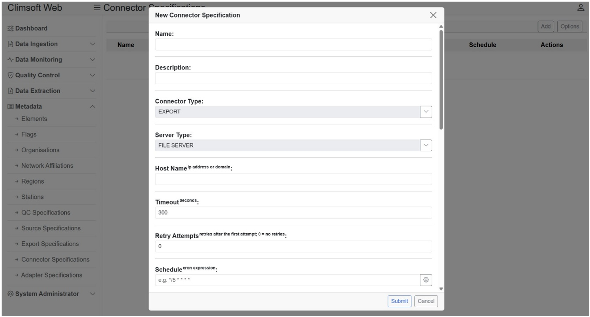
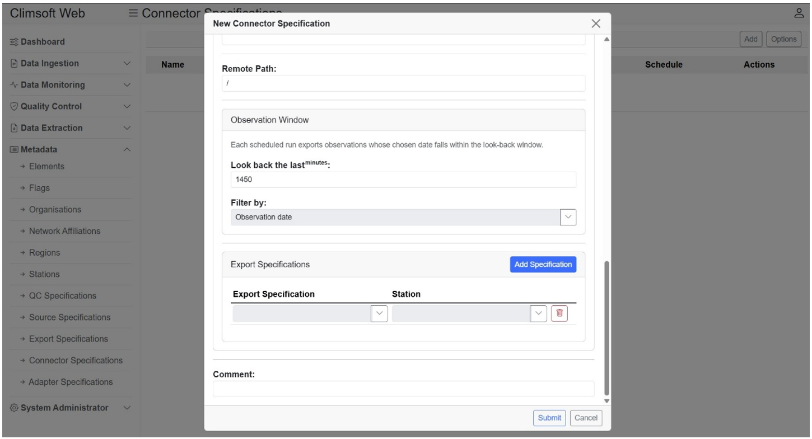

.. _CDMS-ClimSoft:

Using ClimSoft
==============

`Climsoft <https://climsoft.org/>`_ is a Climate Data Management System (CDMS) designed to support the efficient archiving, management, quality control, analysis, and dissemination of a wide range of integrated climate data.
It is developed using free and open-source technologies and is distributed under the GPLv3 license, making it freely available.
Climsoft is widely used in many National Meteorological and Hydrological Services (NMHSs), particularly in developing countries.

Climsoft serves as the authoritative national system for managing and curating climate data.
Through an automated workflow, quality-controlled data from Climsoft can be ingested into a wi2box-instance.
This integration ensures both the reliability of national datasets and their visibility within the global data-sharing ecosystem provided through WIS 2.0.

Below are the steps for configuring Climsoft Web to automatically send data into a wis2box-instance.

1. Define the export specifications for data to be shared on WIS2BOX.
• Go to Metadata > Export Specifications
• Click on Add button. A dialog will open that allows you to create an export specification
• Enter the required fields like name and description. Change the export type to “Dissemination”. Then add the WIS2BOX element mappings. These should correspond to the data elements that you want to share to WIS 2.0 via the WIS2BOX. 
• Click on Submit to save the specification details.

2. Define the connector specifications for connecting to WIS2BOX server
• Go to Metadata > Connector Specifications
• Click on Add button. A dialog will open that allows you to create a connector specification
• Enter the required field like name and description. Change the Connector Type to Export and Server Type to File Server. Then enter the rest of the required fields. The current supported protocol for WIS2BOX is SFTP.  Add the WIS2BOX export specification you created for the stations that you want to share data to WIS 2.0.
• Click on Submit to save the specification details.

Note, both export and connector specifications need to be enabled for automatic export of data to wis2box.
You can always check for success and failures via the System Administrator > Connectors Log interface.

.. note::

   Climsoft Web supports 3 WIS 2.0 report types via wis2box, namely, SYNOP, DAYCLI and CLIMAT.
