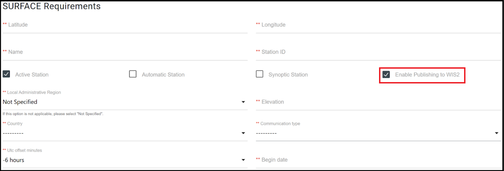
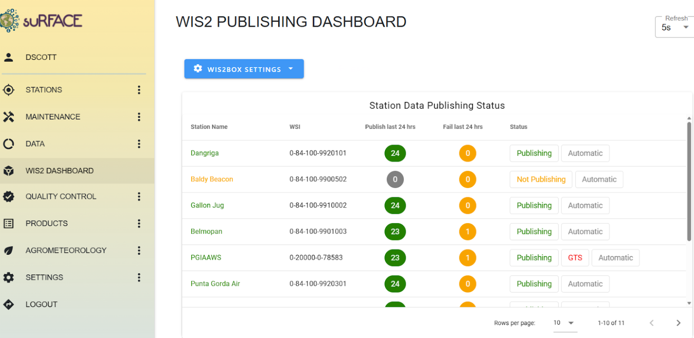

.. _CDMS-SURFACE:

Using SURFACE
=============

The National Meteorological Service of Belize (NMS) developed the System for Unified Real-time Monitoring and Forecasting of Atmospheric and Climatic Events (SURFACE) in 2019 with Brazilian company Elligence Soluções em Tecnologia (Elligence Technological Solutions) known as Elligence, through the Japan Caribbean Climate Change Partnership Project(JCCCP).  

The application is Free and Open Source available on the `SURFACE GitHub repository <https://github.com/NMS-Belize/surface>`_

SURFACE can be configured to send data into wis2box as outlined below. For more information please refer to the SURFACE documentation.

Station configuration
---------------------

For each station you wish to publish on WIS2, ensure "Enable Publishing to WIS2" is enabled in the SURFACE Requirements section:

Then you will be required to enter the following additional metadata:

- WIGOS Station ID (WSI)
- WMO region
- WMO Station Type
- WMO Reporting Status

WIS2 Dashboard
---------------

The WIS2 dashboard displays all stations that have been configured to send hourly(“SYNOP”) messages to a preconfigured WIS2BOX and contains the **wis2box settings**:

To send hourly messages to the WIS2BOX follow the steps below:

**Configure WIS2BOX settings** - Users must input WIS2BOX credentials enabling SURFACE interaction by clicking the blue WIS2box Settings button and selecting “Update WIS2 Credentials”

**Enter storage credentials** for Primary/Secondary or both WIS2BOX by entering the IP address, Port number, username and password for the WIS2BOX you would like to send your messages to.
The credentials are defined by ``WIS2BOX_STORAGE_USERNAME`` and ``WIS2BOX_STORAGE_PASSWORD`` in ``wis2box.env``. 
Please note that SURFACE enables users to send to up to two(2) wis2box instances simultaneously.

**Activate Publishing options** - After required credentials have been input, select the “Not Publishing/Publishing” button to configure Publish Settings.
