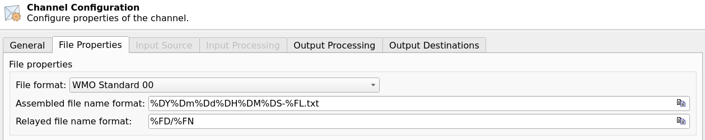
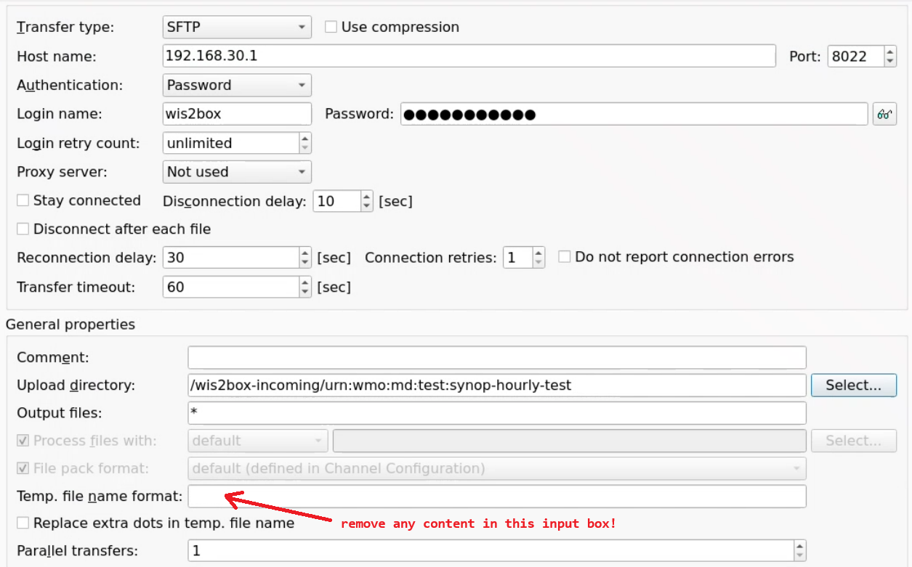

.. _Moving-Weather:

Using Moving Weather
====================

`Moving Weather <https://www.iblsoft.com/products/moving-weather/>`_ is a commercial solution providing an automated meteorological switching system used for the routine distribution of meteorological messages as well
as for generic file switching.

WMO Members using Moving Weather can enable automated data ingestion into wis2box using the SFTP functionality of MinIO.

Configuring MW to send data into wis2box SFTP
-------------------------------------------------

In the 'File Properties' tab of the Channel Configuration-window, make sure to set the file-extension to match data-plugin configured in your dataset.

When ingesting FM-12 synop data, please ensure the year and month can be parsed from the file-name pattern:

Select SFTP as one of the Output Destinations.

If you using the default port mappings the SFTP port for minio on your wis2box-instance is 8022. 

Assuming the wis2box-instance and MW are hosted on the same network can you provide an internal IP of the wis2box-host as the host name.

The upload directory should be set to `/wis2box-incoming/<your-metadata-identifier>`, where <your-metadata-identifier> is the dataset identifier or the topic in the data mappings configured for your dataset in wis2box.

Finally, provide the MinIO storage username and password defined in your wis2box.env file to enable authentication.

**Make sure to leave leave Temp. file name format empty**: the MinIO-SFTP does not support renaming the temporary files uploaded via SFTP,
 so the temporary file name format should be left empty to avoid issues with the data ingest process.  

