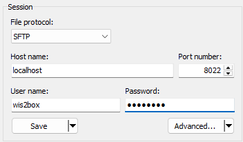
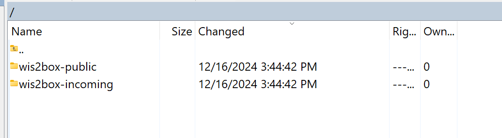

.. _minio-sftp:

Using MiniO SFTP
================

Data can uploaded into MinIO over SFTP.

You can connect to the SFTP service using the MinIO storage username and password as defined by WIS2BOX_STORAGE_USERNAME and WIS2BOX_STORAGE_PASSWORD in your wis2box.env file. By default the SFTP service is enabled on port 8022. 

Using a client such as WinSCP, a user can connect to the SFTP service:

The root-directory of the SFTP service will contain 2 folders for the buckets configured in MinIO: **wis2box-incoming** and **wis2box-public**:

To utilize this functionality, data needs to be uploaded to the ``wis2box-incoming`` bucket, in a directory that matches the dataset metadata identifier or the topic in the data mappings.

For example using the command line from the host running wis2box:

.. code-block:: bash

    sftp -P 8022 -oBatchMode=no -o StrictHostKeyChecking=no wis2box@localhost << EOF
        mkdir wis2box-incoming/urn:wmo:md:it-meteoam:surface-weather-observations.synop
        put /path/to/your/datafile.csv wis2box-incoming/urn:wmo:md:it-meteoam:surface-weather-observations.synop 
    EOF