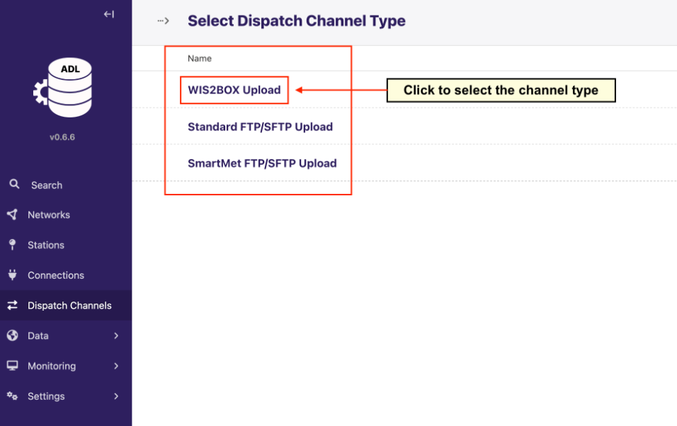
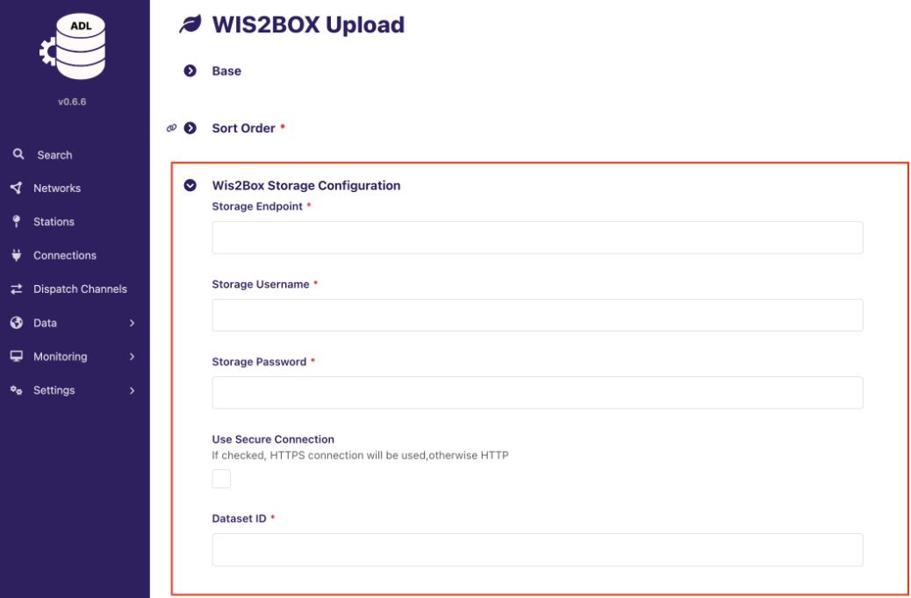

.. _tools-ADL:

Using ADL
==========

The `Automatic Data Loader (ADL) <https://github.com/wmo-raf/adl>`_ 
It provides a `Wagtail <https://wagtail.org/>`_-based interface and supplier-specific wagtail plugins to collect data, manage station metadata and distribute data to different channels.

Configuring ADL Dispatch Channel for wis2box
--------------------------------------------

To send data from ADL into wis2box, you need to configure a new "WIS2BOX Upload" Dispatch Channel in ADL:

.. note::
 
    When using this channel wis2box data-plugins for the dataset must be configured csv2bufr with the `"AWS-template" <https://github.com/World-Meteorological-Organization/csv2bufr-templates/blob/main/templates/aws-template.json>`_ .

You will need to provide the wis2box storage configuration in the "WIS2BOX Upload" channel:

The wis2box storage endpoint by default is `http://<your-host-ip>:9000`. Make sure that the ADL instance can reach this endpoint and that the port is open in your firewall settings between ADL and wis2box.
If the ADL and wis2box are hosted on the same machine you can use `http://localhost:9000` as the storage endpoint.

The storage username and password are defined by the WIS2BOX_STORAGE_USERNAME and WIS2BOX_STORAGE_PASSWORD environment variables in your wis2box.env file.

The Dataset ID should match the dataset identifier or the topic in the data mappings configured for your dataset in wis2box, for example:

``urn:wmo:md:it-meteoam:surface-weather-observations.synop``

Make sure configure the parameters as described at `Parameter Mappings in ADL Dispatch Channels <https://adl-tool.readthedocs.io/en/latest/user_guide/manage_dispatch_channels.html#part-c-parameter-mappings>`_.

Once you have configured the "WIS2BOX Upload" channel make sure use Grafana as described in :ref:`workflow-monitoring` to verify that data is correctly received and processed by your wis2box-instance. 
