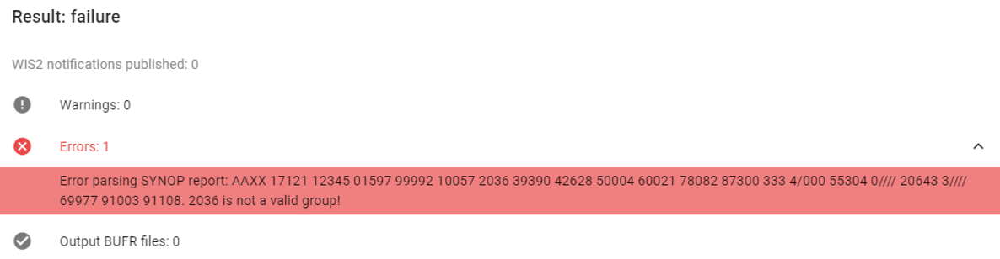
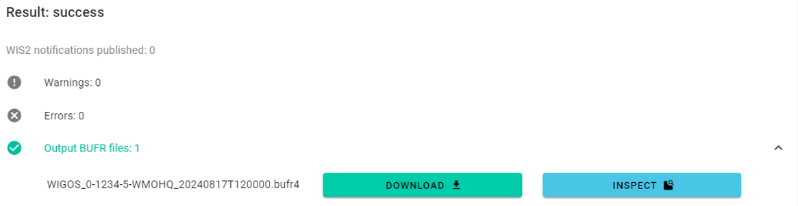
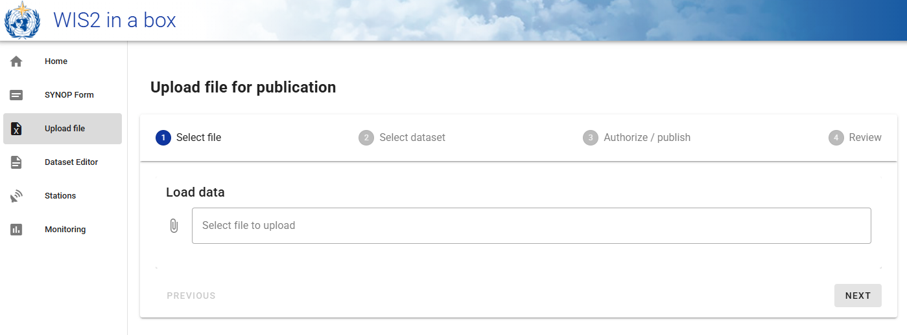

.. _webapp-manual-ingestion:

Manually using the webapp
=========================

The wis2box-webapp available at `WIS2BOX_URL/wis2box-webapp` provides a user interface for manual data ingestion and data conversion.

FM-12 SYNOP form in the wis2box-webapp
--------------------------------------

You can manually ingest FM-12 SYNOP data using the wis2box-webapp.

Select the "FM-12 SYNOP" option from the menu on the left:

.. image:: ../../_static/wis2box-webapp-fm12-synop.png
    :width: 1000
    :alt: wis2box webapp FM-12 SYNOP page

Provide the required information in the form:

- Month and year in UTC 
- FM 12 encoded input data
- Dataset identifier
- Authentication token for 'processes/wis2box'

Then click "Submit" to ingest the data. 

If there are issues during the data conversion you click to open the "Warnings" and "Errors" sections to see the details:

If the data conversion is successful you click on "Output BUFR files" to inspect the result:

Manual file upload using the wis2box-webapp
-------------------------------------------

You can also upload files using the wis2box-webapp, to manually trigger the data ingest process.

To access this interface, select the "Upload file" option from the menu on the left:

And follow the instructions to upload a file.