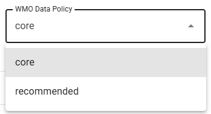
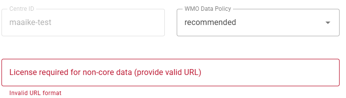

.. _recommended:

Adding a license to recommended datasets
========================================

Data are shared on WIS2 in accordance with the WMO Unified Data Policy (Resolution 1 (Cg-Ext(2021))). 
This data policy describes two categories of data: 
- **core** : data that is provided on a free and unrestricted basis, without charge and with no conditions on use.
- **recommended** : data that may be provided with conditions on use and/or subject to a license.

The WMO data policy is specified by the discovery metadata of the dataset. 

Recommended data:

- May be subject to conditions on use and reuse;
- May have access controls applied to the data;
- Are not cached within WIS2 by the Global Caches;
- Must have a link to a license specifying the conditions of use of the data included in the discovery metadata.

When using the wis2box-webapp, you select in the data-policy during the initial dataset creation step:

**Datasets containing aeronautical meteorological information should be considered recommended data for the purposes of publishing through WIS2**.
For this reason, the wis2box-webapp will automatically set the data policy to recommended for datasets containing **weather/aviation** in the topic hierarchy.

When the WMO Data Policy is set to **recommended** , the wis2box-webapp will required you to provide a link to the license that applies to the dataset:

You can provide a link to a license hosted on your own website, or you can use one of the standard licenses available online, such as the Creative Commons licenses (https://creativecommons.org/licenses/).

If you need to provide a custom license and have no place to host it, you provide your custom license via the `wis2box-public` bucket of your wis2box instance, as described in the next section.

Using a custom license hosted on your wis2box instance
------------------------------------------------------

To upload a locally created file `license.txt` you can use the `MinIO Console` available at port `9001` of your wis2box instance, by going to your web browser and visiting the URL:
`http://<your-host>:9001`

Note that the MinIO Console is not proxied via wis2box web-proxy; you can only access it directly using the IP address or hostname of your wis2box instance,
 on the local network or via a VPN connection.

You can find the credentials to access the MinIO Console in the `wis2box.env` file, as follows:

.. code-block:: bash

   cat wis2box.env | grep WIS2BOX_STORAGE_USERNAME
   cat wis2box.env | grep WIS2BOX_STORAGE_PASSWORD

Once you have logged in to the MinIO Console, you can upload the license file into the `wis2box-public` bucket.

After uploading the license file, check if the file is accessible by visiting the URL:
`WIS2BOX_URL/data/<license-file-name>`

If the file is accessible, you can use the URL `WIS2BOX_URL/data/<license-file-name>` as the link to the license in the dataset creation step in the wis2box-webapp.