.. _setup-datasets:

Adding datasets and discovery metadata
======================================

Datasets in the wis2box are required to define the **discovery metadata** and **data mappings plugins** for data you want to publish:

- **Discovery metadata**: dataset properties such as title, description, keywords, and bounding box used to create a WIS Control Metadata Profile (WCMP2) record for the dataset.
- **Data mappings plugins**: define the actions to be performed on the data before it is published, such as transforming the data from the input source format and validating the data content.

For each dataset you create, a new WCMP2 record will be created and made available in the HTTP storage of your wis2box instance.
The wis2box-broker will publish a WIS2 data notification for the WCMP2 record at the topic `origin/a/wis2/CENTRE_ID/metadata`, where `CENTRE_ID` is the centre-id of the dataset.
This metadata-notification enables the WIS2 Global Discovery Catalogue to download and cache the metadata record, allowing users to discover the dataset when searching the WIS2 Global Discovery Catalogue.

The following sections will explain how to create datasets in your wis2box using the wis2box-webapp.

.. note::

   You can also create datasets by defining MCF files in the ``metadata/discovery`` directory in your wis2box host directory and publish them from the CLI.
   For more information on publishing datasets using MCF files, see the reference documentation.

Accessing the wis2box-webapp
----------------------------

You can access the wis2box-webapp by visiting the URL you specified during the configuration step in your web browser and adding ``/wis2box-webapp`` to the URL.
For example, if you specified ``http://mywis2box.example.com`` as the URL, you can access the wis2box-webapp by visiting ``http://mywis2box.example.com/wis2box-webapp``.

You can check the WIS2BOX_URL environment variable in the ``wis2box.env`` file to find the URL of your wis2box instance:

.. code-block:: bash

   cat wis2box.env | grep WIS2BOX_URL

The wis2box-webapp used basic authentication to control access to the webapp.  The default username is ``wis2box-user`` and the password is the value specified when running the script ``wis2box-create-config.py``.

The values of ``WIS2BOX_WEBAPP_USERNAME`` and ``WIS2BOX_WEBAPP_PASSWORD`` can be found in the ``wis2box.env`` file as follows:

.. code-block:: bash

   cat wis2box.env | grep WIS2BOX_WEBAPP_USERNAME
   cat wis2box.env | grep WIS2BOX_WEBAPP_PASSWORD

.. _adding-datasets:

Creating a new dataset
----------------------

Open the wis2box-webapp in your web browser, provide the WIS2BOX_WEBAPP credentials, and select the **dataset editor** from the menu on the left

You should see the following page:

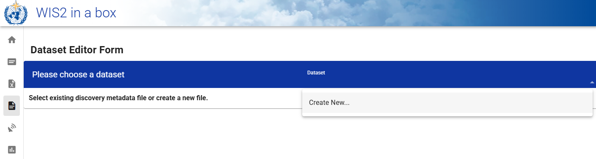

To create a new dataset select "Create new" from the dataset editor page.

A popup will appear where you can define your *"centre-id"* and the *"Template"* of dataset you want to create:

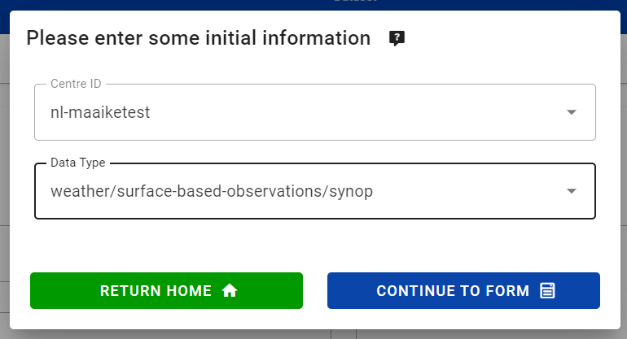

.. note::

   Your centre-id should start with the ccTLD of your country, followed by a - and an abbreviated name of your organization, for example ``fr-meteofrance``.
   The centre-id has to be lowercase and use alphanumeric characters only.
   **To define a new centre-id type the centre-id into the box**, otherwise select one from the dropdown list.
   The dropdown list shows all currently registered centre-ids on WIS2 as well as any new centre-ids for datasets created in your wis2box-instance.

You have the option to select a *Template*, such as "weather/surface-based-observations/synop", "weather/surface-based-observations/temp", and "weather/advisories-warnings":

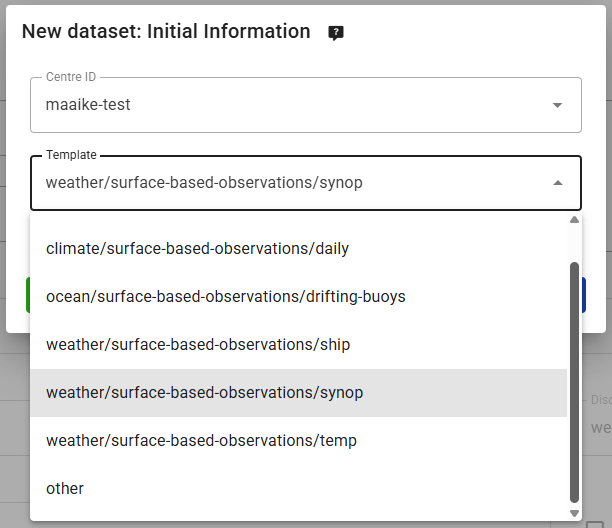

The templates help you to predefine some of the metadata properties and the data mappings plugins for commonly published data-types.

If you don't want to use a template, or your dataset does not fit into one of the predefined templates, select "other" from the dropdown list:

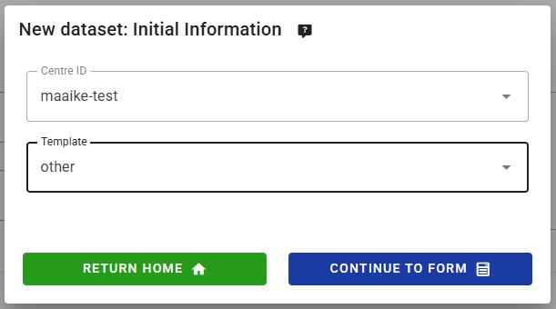

Please select "Continue to form" to start defining your dataset.

Defining the metadata identifier of your dataset
----------------------------------------

When defining your dataset, you will need to specify a **Local ID**, which serves as a short and unique identifier for the dataset within your organization. The Local ID is used to generate the WCMP2 identifier for your metadata record:

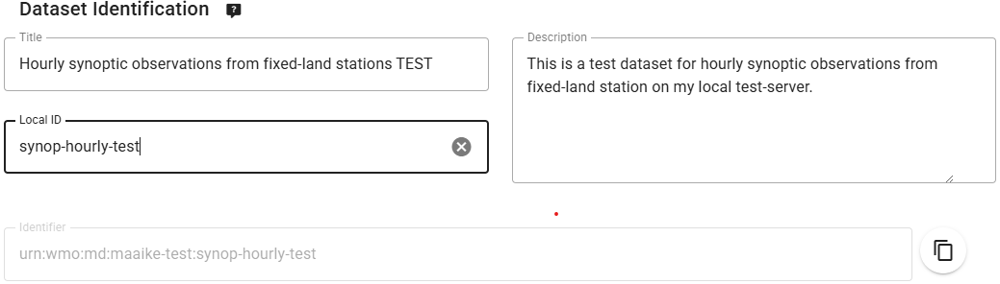

**The local ID is used to generate the metadata identifier for the dataset**. The metadata identifier for your dataset is defined as `urn:wmo:md:<centre-id>:<local-id>`, where `<centre-id>` is the centre-id you defined earlier and `<local-id>` is the local ID you just defined.

.. note::

   If you do not provide a Local ID a randomly generated ID will be assigned. It is strongly suggested to define your own human-readable ID instead. Once the dataset is created, the Local ID cannot be changed. To use a different Local ID, you will need to delete and recreate the dataset.

Defining the topic hierarchy
----------------------------

If you selected a template, the topic hierarchy will be pre-populated with the default topic hierarchy defined in the template, 
for example for the "weather/surface-based-observations/synop" template you will see:

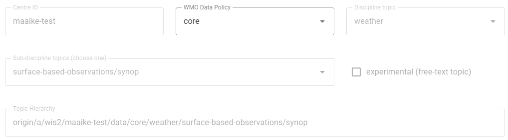

If you selected "other" as the template, you have the option of selecting the "Discipline topic" and "Sub-discipline topics", 
which will be used to define the topic hierarchy for your dataset:

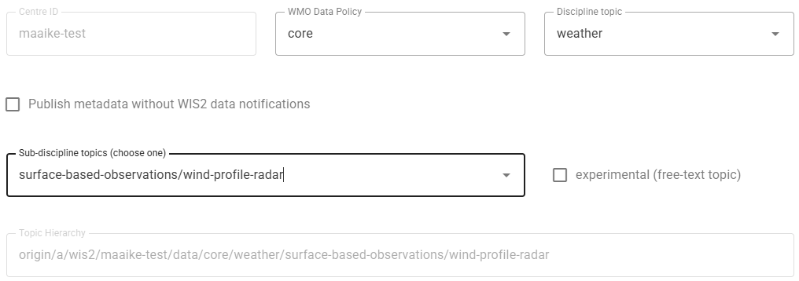

You can choose the WMO Data Policy for your dataset, if you choose "recommended" the wis2box-webapp will require you to provide a link to a license that applies to the dataset.
For more information on publishing recommended datasets, see the section :ref:`recommended`.

If you used "other" as the template you will have the option to select "Publish metadata without WIS2 data notifications". You can use this option if you want to publish metadata only. 
In this case, no Topic Hierarchy is defined and you will need to provide a link to a URL where the data can be downloaded from.

Validating the form
--------------------

Make sure to provide all other fields requested in the form: add a relevant description for your dataset, review and add keywords and choose an appropriate bounding box.
You will also need to provide some contact information for the dataset.

Before publishing the new dataset make to click "Validate form" to check if all required fields are filled in:

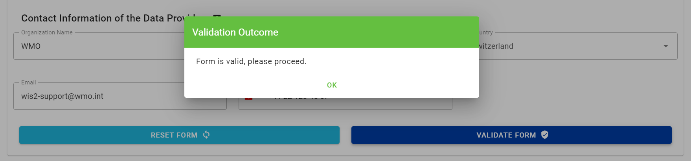

Defining the data mappings plugins
----------------------------------

Each dataset is associated with data-mappings plugins that transform the data from the input source format before the data is published.

If you selected a template, the data mappings plugins will be pre-populated with the default plugins defined in the template.

For example, if you selected the "weather/surface-based-observations/synop" template, the data mappings plugins will be pre-populated with the following plugins:

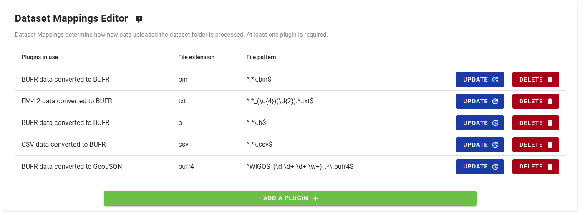

If you selected "other" as the template, you will need to add at least one data mappings plugin to your dataset by clicking the "Add a plugin" button:

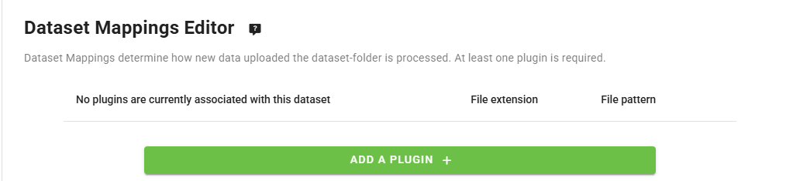

If you wish to publish your data without any transformation or data-validation, you can select the "Universal" plugin:

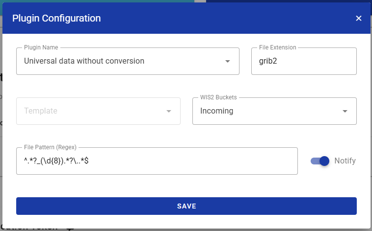

Please verify that the "File Extension" and "File Pattern" are set to match the data-files you will upload to the `wis2box-incoming` bucket in your MinIO storage.

Note that the "File Pattern" may be used to extract additional metadata from the file name, such as the datetime for the published data.

Publishing the dataset
----------------------

When you publish your dataset, the wis2box-webapp will create a WCMP2 record for your dataset 
and publish it to the topic `origin/a/wis2/CENTRE_ID/metadata`, where `CENTRE_ID` is the centre-id of your dataset.

.. note::

   If you want to see the metadata-notification being published, 
   make sure to use an MQTT-client subscribed to wis2box-host using the "everyone/everyone"-credentials before clicking "Publish".

Click "submit" to publish the dataset:

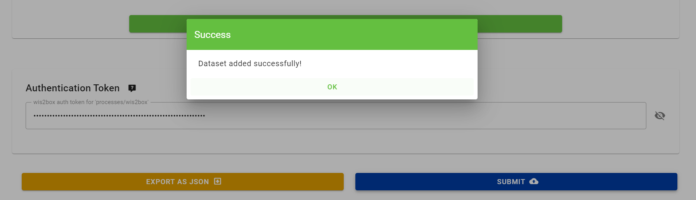

You should see a success message indicating that the dataset has been created successfully.

Next steps
----------

If your dataset is using any of the following plugins in the data mappings, you will need to provide station metadata before you can start publishing data:

- BUFR data converted to BUFR
- FM-12 data converted to BUFR
- CSV data converted to BUFR

See :ref:`setup-stations` on how to add station metadata in your wis2box instance.

Otherwise, you can start publishing data to the dataset by uploading files to the `wis2box-incoming` bucket in your MinIO storage as described in the :ref:`data-ingest` section of the user guide.

.. _`WIS2 topic hierarchy`: https://github.com/World-Meteorological-Organization/wis2-topic-hierarchy
