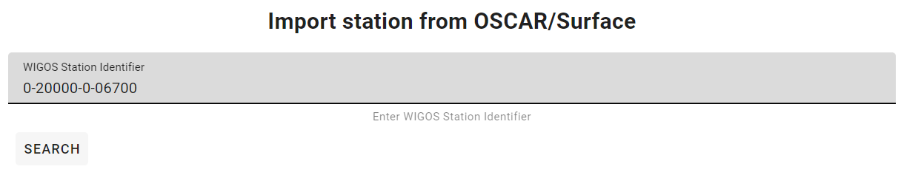
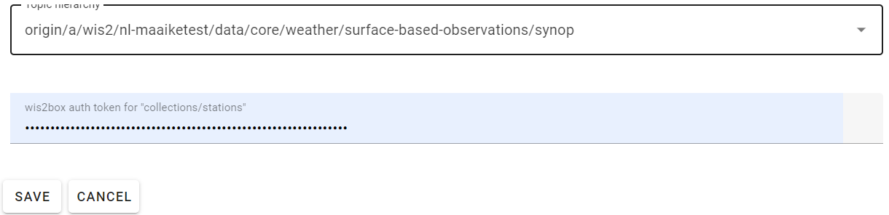

.. _setup-stations:

Adding station metadata
=======================

To publish data-notifications using the wis2box using a plugin other than the 'Universal' plugin, you need to add station metadata to your wis2box instance.

The station metadata is used to check that the data you are publishing is associated with a valid station and to add additional metadata where required.

Stations can be added interactively using the wis2box-webapp or by bulk inserting stations from a CSV file.

If you want to bulk insert station metadata from a CSV file, please refer to the `Bulk inserting stations from CSV`_ section.

Adding stations using the wis2box-webapp
----------------------------------------

The station editor can be accessed in the wis2box-webapp by selecting "Stations" from the menu on the left.

.. image:: ../_static/wis2box-webapp-stations.png
  :width: 800
  :alt: wis2box webapp stations page

Select "Create new" to start adding a new station.

You need to provide a WIGOS station identifier that will be used to import information about the station from OSCAR:

You can search for the station in OSCAR by providing the WIGOS station identifier and clicking "search".
If the station is found a new form will be displayed with the station information.
If the station is not found you have the option to fill the station form manually.

Check the form for any missing information.
You will need to select a WIS2 topic you would like to associate the station with.
The station editor will show you the available topics to choose from based on the datasets you have created.
If you don't see the topic you want to associate the station with, you need to create a dataset for that topic first.

To store the station metadata  click "save" and provide the 'collections/stations' token you created in the previous section:

Bulk inserting stations from CSV
--------------------------------

You can also bulk insert a set of stations from a CSV file, by defining the stations in ``mystations.csv`` in your wis2box host directory and running the following command:

.. code-block:: bash

   python3 wis2box-ctl.py login
   wis2box metadata station publish-collection --path /data/wis2box/mystations.csv --topic-hierarchy origin/a/wis2/mw-mw_met_centre-test/data/core/weather/surface-based-observations/synop

.. note::

   The ``path`` argument refers to the path of the CSV file within the wis2box-management container.
   The directory defined by WIS2BOX_HOST_DATADIR is mounted as /data/wis2box in the wis2box-management container.

   The ``topic-hierarchy`` argument refers to the WIS2 topic hierarchy you want to associate the stations with.

After doing a bulk insert please review the stations in wis2box-webapp to ensure the stations were imported correctly.

Next steps
----------

The next step is to prepare data ingestion into wis2box, see :ref:`data-ingest`.

.. _`WIS2 topic hierarchy`: https://github.com/World-Meteorological-Organization/wis2-topic-hierarchy
.. _`OSCAR`: https://oscar.wmo.int/surface
