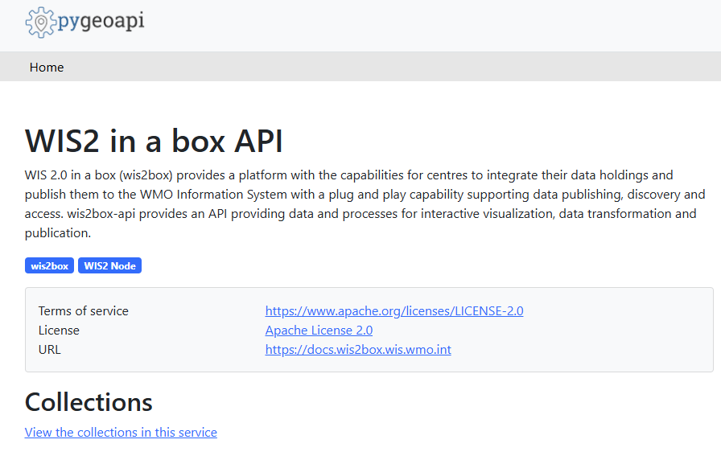
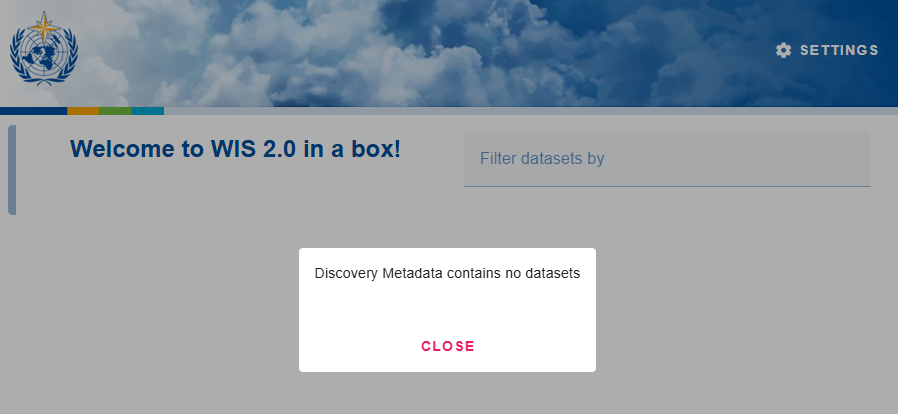
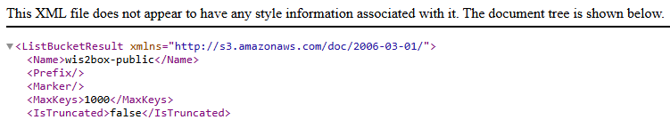

.. _setup:

Installation and configuration
==============================

This section summarizes the steps required to install a wis2box instance and setup your own datasets using initial configuration files
provided by using the ``wis2box-create-config.py`` script.

Ensure you have Docker, Docker Compose and Python installed on your host, 
and that you meet the system and network requirements as detailed in the :ref:`getting-started` section.

Download
--------

Download `wis2box-setup.zip` from the `wis2box Releases`_ page and unzip using the following commands:

.. code-block:: bash

   wget https://github.com/World-Meteorological-Organization/wis2box-release/releases/download/1.0.0/wis2box-setup.zip
   unzip wis2box-setup.zip
   cd wis2box

Create initial configuration files
----------------------------------

Run the following command to create the initial configuration files for your wis2box:

.. code-block:: bash

   python3 wis2box-create-config.py

.. note::

    The ``wis2box-create-config.py`` script will ask for a directory to store the configuration files.
    Please provide the **absolute** path to the directory where you want to store the configuration files, for example ``/home/wis2box-user/wis2box-data``.
    This directory will be mapped to ``/data/wis2box`` **inside** the wis2box-management container.

   The script will also ask for the URL of your wis2box. Please provide the public URL of your wis2box, for example ``http://mywis2box.example.com``.
   For testing purpose you can also provide the internal IP address you use to access the host, for example ``http://192.168.0.3`` and you change the URL in configuration files at a later point in time.

   The script will propose to automatically create a password for ``WIS2BOX_WEBAPP_PASSWORD``. This password is used to access the wis2box-webapp interface.

   The script will also propose to automatically create passwords for ``WIS2BOX_STORAGE_PASSWORD`` and ``WIS2BOX_BROKER_PASSWORD``.
   These passwords are for internal use only within the wis2box, and it is recommended to accept the randomly generated passwords.

The script will have created a file "wis2box.env" with the configuration settings required to start your wis2box.

.. note::

   You can edit the environment variables ``WIS2BOX_BASEMAP_URL`` and ``WIS2BOX_BASEMAP_ATTRIBUTION``
   in ``wis2box.env`` to customize the base-map URL and attribution that will be used in the wis2box frontends.

Starting wis2box
----------------

Once you have prepared the necessary configuration files as described above you are ready to start the wis2box.

Run the following command to start wis2box:

.. code-block:: bash

   python3 wis2box-ctl.py start

When running this command for the first time, you will see the following output:

.. code-block:: bash

   No docker-compose.images-*.yml files found, creating one
   Current version=Undefined, latest version=1.0.0
   Would you like to update ? (y/n/exit)

Select ``y`` and the the script will create the file ``docker-compose.images-1.0.0.yml`` file, download the required Docker images and start the services.

Downloading the images may take some time depending on your internet connection speed. This step is only required the first time you start wis2box.

.. note::

   The ``wis2box-ctl.py`` program is used as a convenience utility around a set of Docker Compose commands.
   You can customize the ports exposed on your host by editing ``docker-compose.override.yml``.

.. note::

   In case you get errors from the Docker daemon stating 'Permission denied', such as:

   ``docker.errors.DockerException: Error while fetching server API version: ('Connection aborted.', PermissionError(13, 'Permission denied'))``

   Please ensure your username is added to the Docker group using the command:

   ``sudo usermod -aG docker <your-username>``.

   Logout and log back in so that your group membership is re-evaluated.

Once the command above is completed, check that all services are running (and healthy).

.. code-block:: bash

   python3 wis2box-ctl.py status

Check that all services are Up and not unhealthy:

.. code-block:: bash

            Name                       Command                  State                           Ports
   -----------------------------------------------------------------------------------------------------------------------
   elasticsearch            /bin/tini -- /usr/local/bi ...   Up (healthy)   9200/tcp, 9300/tcp
   grafana                  /run.sh                          Up             0.0.0.0:3000->3000/tcp
   loki                     /usr/bin/loki -config.file ...   Up             3100/tcp
   mosquitto                /docker-entrypoint.sh /usr ...   Up             0.0.0.0:1883->1883/tcp, 0.0.0.0:8884->8884/tcp
   mqtt_metrics_collector   python3 -u mqtt_metrics_co ...   Up             8000/tcp, 0.0.0.0:8001->8001/tcp
   nginx                    /docker-entrypoint.sh ngin ...   Up             0.0.0.0:80->80/tcp
   prometheus               /bin/prometheus --config.f ...   Up             9090/tcp
   wis2box                  /entrypoint.sh wis2box pub ...   Up
   wis2box-api              /app/docker/es-entrypoint.sh     Up
   wis2box-auth             /entrypoint.sh                   Up
   wis2box-minio            /usr/bin/docker-entrypoint ...   Up (healthy)   0.0.0.0:9000->9000/tcp, 0.0.0.0:9001->9001/tcp
   wis2box-ui               /docker-entrypoint.sh ngin ...   Up             0.0.0.0:9999->80/tcp
   wis2box-webapp           sh /wis2box-webapp/ ...          Up (healthy)   4173/tcp

Refer to the :ref:`troubleshooting` section if this is not the case.

Check MQTT connection
----------------------

You can check that the MQTT broker is running and accepting connections using `MQTT Explorer`_ or by using a Linux command line tool such as `mosquitto_sub`.

Two sets of users are created for the MQTT broker:

username=**everyone**:
- This user is used for public access to the MQTT broker and has read-only access on `origin/#` topic. 
- This user can be used to allow the WIS2 Global Broker to subscribe to the wis2box.
- The password for this user is ``everyone``.

username=**wis2box**
- This user is used by wis2box services to publish data to the MQTT broker.
- The password for this user is defined in the ``WIS2BOX_BROKER_PASSWORD`` environment variable in ``wis2box.env``.

The wis2box MQTT broker is available on port ``1883`` on the host.

The nginx-proxy enables access to the MQTT broker via WebSockets on port ``80`` on the path `/mqtt`.

See the section :ref:`public-services-setup` for information on adding SSL encryption to the MQTT broker.

Check HTTP interfaces on web-proxy
----------------------------------

Check the wis2box API is available at `WIS2BOX_URL/oapi`:

Check the wis2box user interface is available at `WIS2BOX_URL/`:

Check the proxy to the "wis2box-public" bucket from the storage service is available at `WIS2BOX_URL/data/`:

Runtime configuration
---------------------

Before proceeding with the next steps, you need to prepare authentication tokens for updating your stations and running processes in the wis2box-webapp.

Login to the wis2box-management container

.. code-block:: bash

   python3 wis2box-ctl.py login

To create a token for running wis2box processes:

.. code-block:: bash

   wis2box auth add-token --path processes/wis2box

Record the token value displayed in a safe place, you will need it to run processes in the next section.

To create a token for updating stations:

.. code-block:: bash

   wis2box auth add-token --path collections/stations

Record the token value displayed in the output of the command above. You will use this token to update stations in the next section.

You can now logout of wis2box-management container:

.. code-block:: bash

   exit

Next steps
----------

The next step is to configure datasets in wis2box, see :ref:`setup-datasets`.

.. _`MQTT Explorer`: https://mqtt-explorer.com/
.. _`wis2box Releases`: https://github.com/World-Meteorological-Organization/wis2box-release/releases
