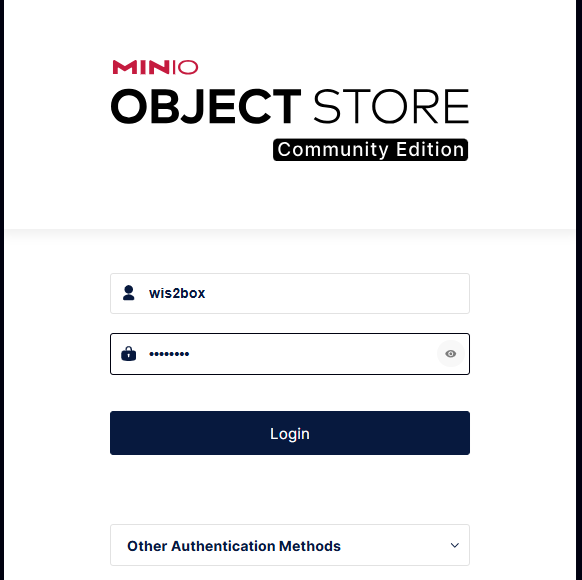
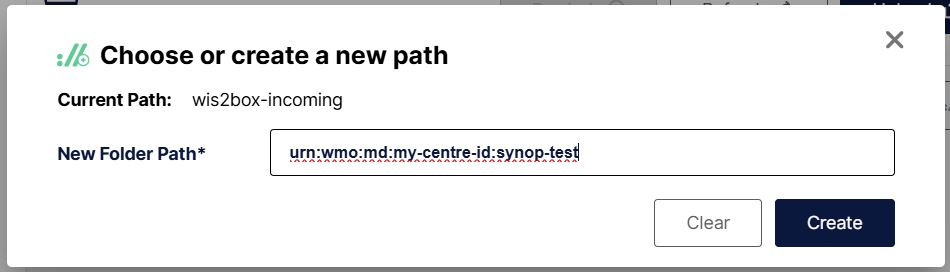
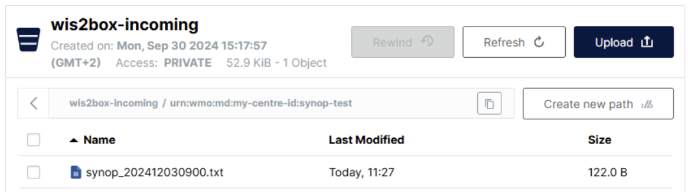

.. _minio-console:

Testing using MinIO Console
===========================

To access the MinIO user interface, visit ``http://<your-host-ip>:9001`` in your web browser.

You can login with your ``WIS2BOX_STORAGE_USERNAME`` and ``WIS2BOX_STORAGE_PASSWORD``:

.. note::

   The ``WIS2BOX_STORAGE_USERNAME`` and ``WIS2BOX_STORAGE_PASSWORD`` are defined in the ``wis2box.env`` file.

To test the data ingest, add a sample file for your observations in the ``wis2box-incoming`` storage bucket in the path matching your dataset identifier as follows:

- Select 'browse' on the ``wis2box-incoming`` bucket and select 'Choose or create a new path' to define a new folder path. 

Define a new folder path that matches the dataset metadata identifier or the topic in the data mappings, for example:

- Enter the folder path and use "Upload" to upload a file from your local machine in the newly created folder path:

After uploading a file to ``wis2box-incoming`` storage bucket, you can browse the content in the ``wis2box-public`` bucket. 
If the data ingest was successful, data will have been moved to the ``wis2box-public`` bucket, in a folder matching the dataset identifier.

If the no data appears in the ``wis2box-public`` bucket, check for errors and warnings in the dashboard at ``http://<your-host-ip>:3000``.
After addressing the issues, you can re-upload the file to the correct folder in ``wis2box-incoming`` bucket to trigger the data ingest process again.

Once you have verified that the data ingest is working correctly you can prepare an automated workflow to send your data into wis2box.
        