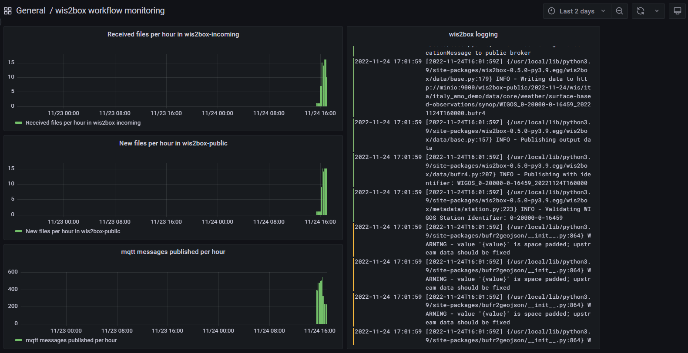

.. _workflow-monitoring:

Data ingest workflow monitoring
===============================

The wis2box-stack includes a `Grafana`_ service to provide pre-configured monitoring dashboards, based on metrics collected by  `Prometheus`_ and logs stored by `Loki`_.

To access the Grafana service, visit ``http://<your-host-ip>:3000`` in your web browser.

The Grafana homepage shows an overview with the number of files received, new files produced and WIS2 notifications published.

The `Station data publishing status` panel (on the left side) shows an overview of notifications and failures per configured station.

The `wis2box ERRORs` panel (on the bottom) prints all ERROR messages reported by the wis2box-management container.

The 'EXPLORE'-option available in the left hand side allows you to see the full logs of all containers running on the wis2box-instance.

To access the logs please select 'wis2box-loki' as the data-source and 'container_name' as the label.

For more details on the monitoring stack in wis2box, see the :ref:`grafana` section in the reference guide.

.. _`Grafana`: https://grafana.com/docs/grafana/latest/
.. _`Prometheus`: https://prometheus.io/docs/introduction/overview/
.. _`Loki`: https://grafana.com/docs/loki/latest/